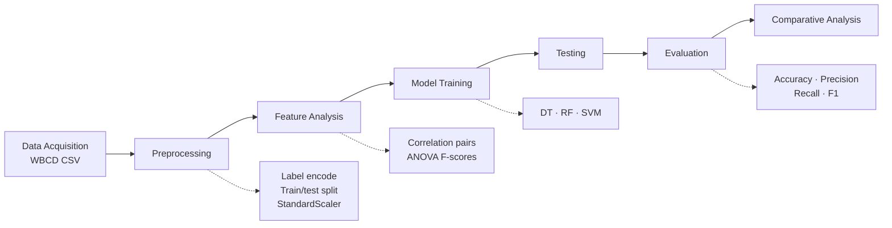
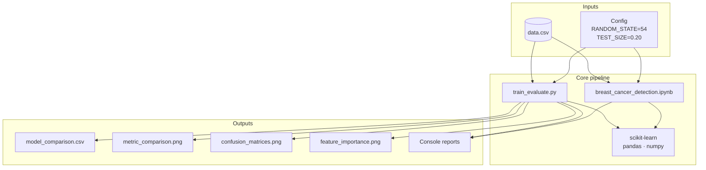
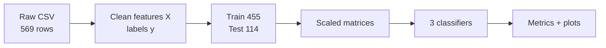
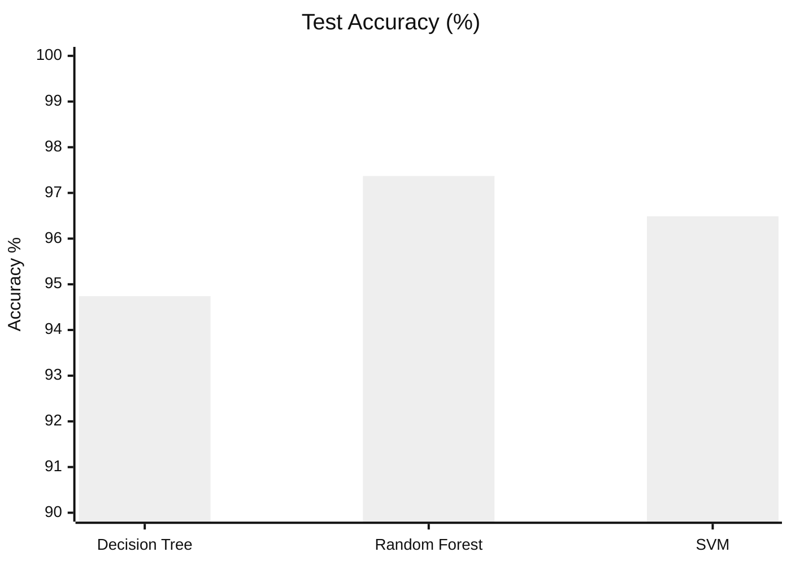

# Breast Cancer Detection — Comparative Study

A comparative study of machine learning methods for **early breast cancer detection** using medical data from the Wisconsin Breast Cancer Diagnostic (WBCD) dataset.

| | |
|---|---|
| **Problem** | Binary classification: Benign vs Malignant |
| **Models** | Decision Tree · Random Forest · SVM (RBF) |
| **Dataset** | WBCD — 569 samples, 30 features |
| **Best model** | Random Forest — **97.37%** accuracy, **95.24%** recall |
| **Code** | [`train_evaluate.py`](train_evaluate.py) · [`breast_cancer_detection.ipynb`](breast_cancer_detection.ipynb) |

---

## Table of contents

1. [Pipeline overview](#pipeline-overview)
2. [System architecture](#system-architecture)
3. [Dataset](#dataset)
4. [Methodology](#methodology)
5. [Models & hyperparameters](#models--hyperparameters)
6. [Results](#results)
7. [Visual outputs](#visual-outputs)
8. [Project structure](#project-structure)
9. [Setup & run](#setup--run)
10. [Dependencies](#dependencies)
11. [Interpretation & notes](#interpretation--notes)

---

## Pipeline overview

End-to-end flow used in both the script and the notebook:



### Detailed pipeline

```mermaid
flowchart TD
    subgraph ACQ[1. Data Acquisition]
        A1[Load data.csv] --> A2[Drop id / Unnamed columns]
        A2 --> A3[569 × 30 features + diagnosis]
    end

    subgraph PRE[2. Preprocessing]
        B1[Encode M→1, B→0] --> B2[Stratified 80/20 split]
        B2 --> B3[StandardScaler fit on train]
        B3 --> B4[Transform train & test]
    end

    subgraph FEAT[3. Feature Selection / Analysis]
        C1[Correlation analysis<br/>|r| > 0.95] --> C2[ANOVA SelectKBest<br/>rank all features]
        C2 --> C3[Models use all scaled features]
    end

    subgraph TRAIN[4–5. Training & Testing]
        D1[Decision Tree] --> E1[Predict on test]
        D2[Random Forest<br/>n_estimators=100] --> E1
        D3[SVM RBF<br/>C=1.0] --> E1
    end

    subgraph EVAL[6. Evaluation & Comparison]
        F1[Confusion matrices] --> F2[Metric table]
        F2 --> F3[Bar charts + RF feature importance]
        F3 --> F4[Select best model]
    end

    ACQ --> PRE --> FEAT --> TRAIN --> EVAL
```

---

## System architecture



### Data flow



---

## Dataset

| Property | Value |
|----------|--------|
| Name | Wisconsin Breast Cancer Diagnostic (WBCD) |
| File | [`data.csv`](data.csv) |
| Samples | **569** |
| Features (after cleaning) | **30** numeric |
| Classes | Benign (`B`) = **357** · Malignant (`M`) = **212** |
| Missing values | **0** |
| Target encoding | `M` → **1** (positive), `B` → **0** |
| Split | Stratified **80% / 20%** → train **455** / test **114** |

### Feature groups

Each of 10 nucleus measurements is summarized three ways (**mean**, **standard error**, **worst**):

| Base measurement | Description |
|------------------|-------------|
| `radius` | Mean of distances from center to perimeter |
| `texture` | Standard deviation of gray-scale values |
| `perimeter` | Nucleus perimeter |
| `area` | Nucleus area |
| `smoothness` | Local variation in radius lengths |
| `compactness` | Perimeter² / area − 1.0 |
| `concavity` | Severity of concave portions |
| `concave points` | Number of concave portions |
| `symmetry` | Nucleus symmetry |
| `fractal_dimension` | Coastline approximation − 1 |

Dropped before modeling: `id`, empty / `Unnamed` columns.

---

## Methodology

### 1. Data acquisition
Load WBCD from `data.csv` and remove identifiers / empty columns so only diagnostic features remain.

### 2. Preprocessing
- Map diagnosis labels to integers (Malignant = positive class for cancer detection).
- Stratified train–test split so both sets keep the Benign/Malignant ratio.
- Fit `StandardScaler` on the **training** set only; transform train and test (avoids leakage).

### 3. Feature selection / analysis
- Report highly correlated feature pairs (`|r| > 0.95`) for the methodology chapter.
- Rank features with ANOVA F-scores (`SelectKBest`, `k="all"`).
- **Training uses all 30 scaled features** (thesis-aligned configuration).

### 4–5. Model training & testing
Fit three classifiers on scaled train data; predict on held-out test data.

### 6. Evaluation & comparative analysis
Compute Accuracy, Precision, Recall, and F1 (positive class = Malignant). Export tables and plots to [`outputs/`](outputs/).

---

## Models & hyperparameters

| Model | Library class | Key settings |
|-------|---------------|--------------|
| Decision Tree | `DecisionTreeClassifier` | `random_state=54` |
| Random Forest | `RandomForestClassifier` | `n_estimators=100`, `random_state=54` |
| SVM | `SVC` | `kernel="rbf"`, `C=1.0`, `gamma="scale"`, `random_state=54` |

### Shared experiment config

| Parameter | Value | Role |
|-----------|--------|------|
| `RANDOM_STATE` | `54` | Reproducible split & models (thesis-aligned RF ranking) |
| `TEST_SIZE` | `0.20` | 20% hold-out test set |
| `CORR_THRESHOLD` | `0.95` | Correlation reporting only (no column drop) |
| Scaling | `StandardScaler` | Zero-mean, unit-variance features |
| Stratify | `y` | Preserve class balance in split |

---

## Results

Test-set metrics (%), positive class = **Malignant**:

| Model | Accuracy | Precision | Recall | F1-Score |
|-------|----------|-----------|--------|----------|
| Decision Tree | 94.74 | 92.86 | 92.86 | 92.86 |
| **Random Forest** | **97.37** | **97.56** | **95.24** | **96.39** |
| SVM | 96.49 | 97.50 | 92.86 | 95.12 |



### Ranking


**Winner: Random Forest** — highest accuracy and F1, with strong recall (important for catching malignant cases).

---

## Visual outputs

Generated by `python train_evaluate.py` into [`outputs/`](outputs/):

### Metric comparison


### Confusion matrices


### Random Forest — top feature importance


| File | Description |
|------|-------------|
| [`outputs/model_comparison.csv`](outputs/model_comparison.csv) | Numeric results table |
| [`outputs/metric_comparison.png`](outputs/metric_comparison.png) | Grouped bar chart of Accuracy / Precision / Recall / F1 |
| [`outputs/confusion_matrices.png`](outputs/confusion_matrices.png) | Side-by-side confusion matrices |
| [`outputs/feature_importance.png`](outputs/feature_importance.png) | Top-15 RF feature importances |

---

## Project structure

```
CANCER DETECTION 2/
├── README.md                         # This file
├── requirements.txt                  # Python dependencies
├── data.csv                          # WBCD dataset
├── data 2.csv                        # Duplicate copy of dataset
├── train_evaluate.py                 # Full pipeline script + plots
├── breast_cancer_detection.ipynb     # Interactive Jupyter notebook
├── archive.zip                       # Archive bundle
├── outputs/
│   ├── model_comparison.csv
│   ├── metric_comparison.png
│   ├── confusion_matrices.png
│   └── feature_importance.png
└── *.docx / *.pdf                    # Thesis chapters & related documents
```

### Code entry points

| Path | Purpose |
|------|---------|
| `train_evaluate.py` | Reproducible CLI: train → evaluate → save CSV/PNG |
| `breast_cancer_detection.ipynb` | Same pipeline for exploration and thesis figures |

---

## Setup & run

### 1. Clone

```bash
git clone https://github.com/vishalpanwar416/cancer-detection.git
cd cancer-detection
```

### 2. Create environment

```bash
python -m venv .venv
source .venv/bin/activate          # Windows: .venv\Scripts\activate
pip install -r requirements.txt
```

### 3. Run the script

```bash
python train_evaluate.py
```

Expected console stages:

1. Data Acquisition  
2. Data Preprocessing  
3. Feature Selection / Analysis  
4–5. Model Training & Testing  
6. Performance Evaluation & Comparative Analysis  

Artifacts are written under `outputs/`.

### 4. Run the notebook

```bash
jupyter notebook breast_cancer_detection.ipynb
# or: jupyter lab breast_cancer_detection.ipynb
```

---

## Dependencies

From [`requirements.txt`](requirements.txt):

| Package | Role |
|---------|------|
| `numpy` | Numerical arrays |
| `pandas` | Data loading & tables |
| `scikit-learn` | Models, split, scaling, metrics, ANOVA |
| `matplotlib` | Plotting |
| `seaborn` | Heatmaps & styled charts |
| `jupyter` / `ipykernel` | Notebook runtime |

---

## Interpretation & notes

- **Recall** is emphasized for malignant detection: missing a cancer case (false negative) is costlier than a false positive in screening contexts.
- Random Forest’s ensemble averaging tends to outperform a single Decision Tree and edges SVM on this split.
- Correlation / ANOVA steps support the methodology write-up; they do **not** drop features before training in the current config.
- Results depend on `random_state=54` and the fixed 80/20 stratified split — re-running with the same config reproduces the table above.

### Metrics (definitions)

| Metric | Meaning here |
|--------|----------------|
| Accuracy | Overall correct predictions |
| Precision | Of predicted malignant, how many were malignant |
| Recall | Of actual malignant, how many were found |
| F1-Score | Harmonic mean of Precision and Recall |

---

## License & attribution

Academic / research project.  
**Dataset:** Wisconsin Breast Cancer Diagnostic — UCI Machine Learning Repository / common public WBCD exports.
