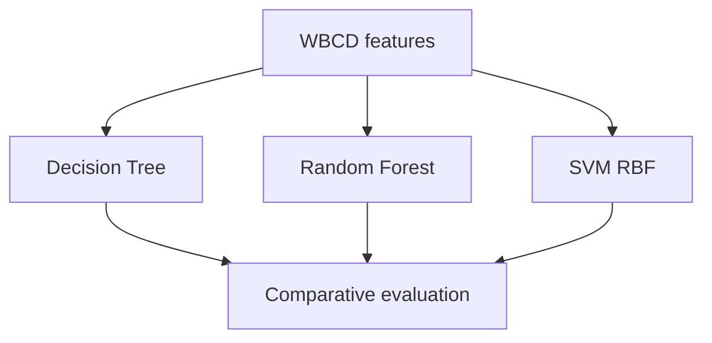
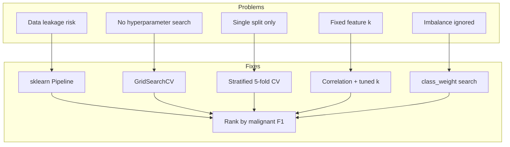
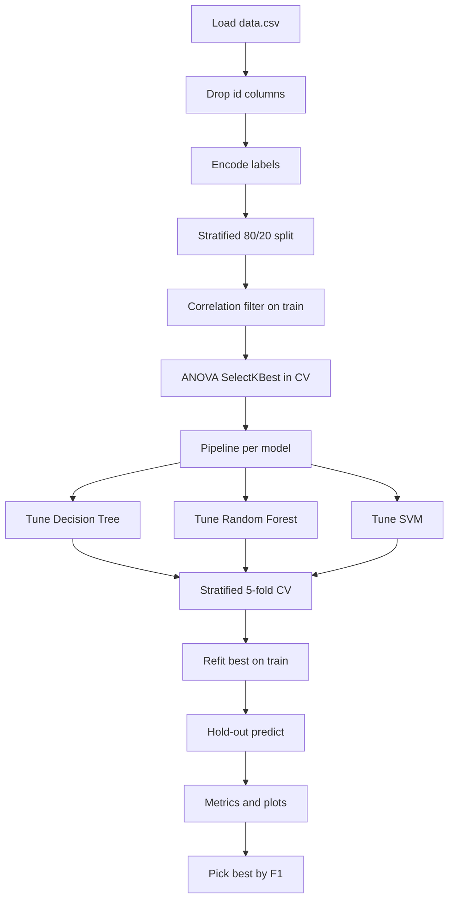
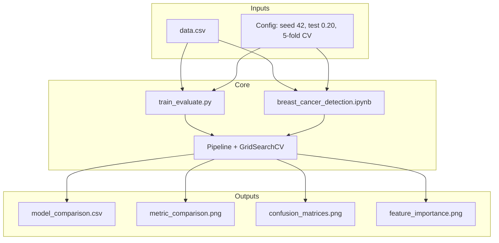
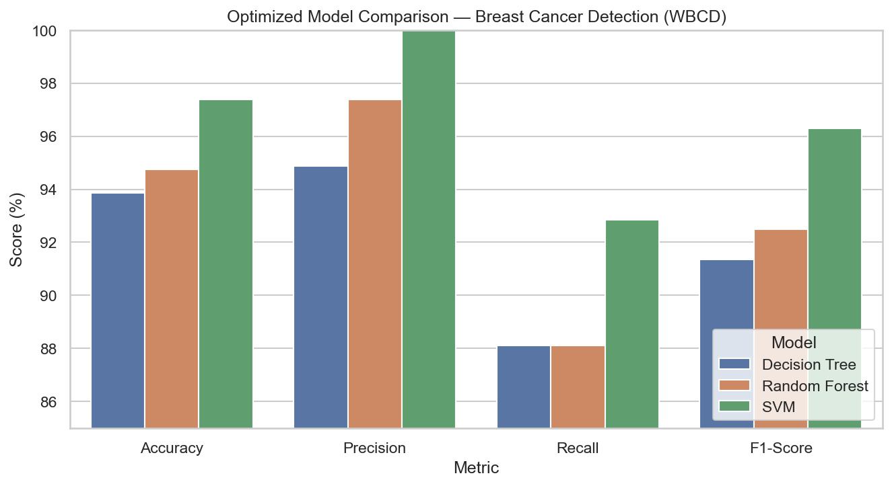
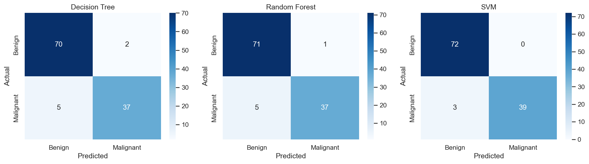
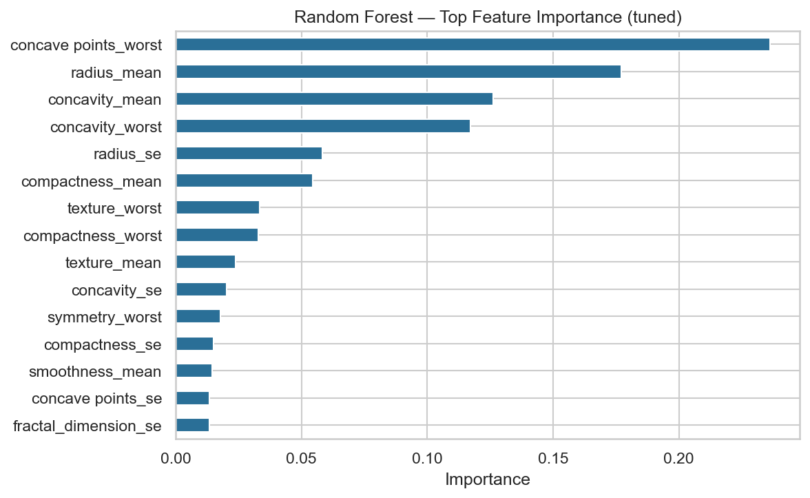

# A Comparative Study of Methods for Early Breast Cancer Detection Using Medical Data

This repository documents my research on **early breast cancer detection** using the Wisconsin Breast Cancer Diagnostic (WBCD) dataset. I compared classical machine learning approaches, refined the experimental setup for thesis alignment, and then applied systematic optimizations for leakage-safe validation and hyperparameter tuning.

| | |
|---|---|
| **Research problem** | Binary classification — Benign vs Malignant |
| **Approaches studied** | Decision Tree · Random Forest · Support Vector Machine (RBF) |
| **Dataset** | WBCD — 569 samples, 30 numeric features |
| **Final best model** | **SVM (optimized)** — 97.37% accuracy · 96.30% F1 · 92.86% recall |
| **Code** | [`train_evaluate.py`](train_evaluate.py) · [`breast_cancer_detection.ipynb`](breast_cancer_detection.ipynb) |

---

## Table of contents

1. [Research objective](#1-research-objective)
2. [Dataset](#2-dataset)
3. [Approaches studied](#3-approaches-studied)
4. [Research phases and experimental setups](#4-research-phases-and-experimental-setups)
5. [Optimizations I applied](#5-optimizations-i-applied)
6. [Final optimized pipeline](#6-final-optimized-pipeline)
7. [System architecture](#7-system-architecture)
8. [Results across phases](#8-results-across-phases)
9. [Visual outputs](#9-visual-outputs)
10. [Conclusions](#10-conclusions)
11. [Project structure](#11-project-structure)
12. [Setup and run](#12-setup-and-run)
13. [Dependencies](#13-dependencies)

---

## 1. Research objective

The goal of this study was to:

1. Compare **Decision Tree**, **Random Forest**, and **SVM** for early breast cancer detection on WBCD medical features.
2. Follow a clear ML pipeline: data acquisition → preprocessing → feature selection → training → evaluation → comparative analysis.
3. Prioritize **malignant-class performance** (especially recall / F1), because missing a cancer case is clinically costly.
4. Improve the experimental design over successive phases so results are more **reproducible**, **leakage-safe**, and **fairly tuned**.


---

## 2. Dataset

| Property | Value |
|----------|--------|
| Name | Wisconsin Breast Cancer Diagnostic (WBCD) |
| File | [`data.csv`](data.csv) |
| Samples | **569** |
| Features | **30** numeric cell-nucleus measurements |
| Classes | Benign (`B`) = **357** · Malignant (`M`) = **212** |
| Missing values | **0** |
| Label encoding | `M` → **1** (positive), `B` → **0** |

Each of 10 nucleus measurements appears as **mean**, **standard error**, and **worst** (e.g. `radius_mean`, `radius_se`, `radius_worst`).  
Before modeling I drop `id` and empty / `Unnamed` columns.

---

## 3. Approaches studied

I kept the same three classifier families across all research phases so comparisons stay meaningful.

### Approach A — Decision Tree

| Aspect | Detail |
|--------|--------|
| Idea | Hierarchical if–then rules on feature thresholds |
| Why I included it | Interpretable baseline; common in medical decision-support literature |
| Strengths | Easy to explain; fast to train |
| Limits | Can overfit; often weaker than ensembles |

### Approach B — Random Forest

| Aspect | Detail |
|--------|--------|
| Idea | Ensemble of trees with bagging + feature randomness |
| Why I included it | Strong tabular baseline; provides feature importance |
| Strengths | Robust to noise; good accuracy on WBCD in literature |
| Limits | Less transparent than a single tree; needs tuning for depth / trees |

### Approach C — Support Vector Machine (RBF)

| Aspect | Detail |
|--------|--------|
| Idea | Maximum-margin classifier with RBF kernel in feature space |
| Why I included it | Strong on medium-sized, scaled numeric medical datasets |
| Strengths | Handles non-linear boundaries well after scaling |
| Limits | Needs careful `C` / `gamma` tuning; less interpretable |



---

## 4. Research phases and experimental setups

I ran the study in **three phases**. Each phase kept DT / RF / SVM but changed preprocessing, validation, or tuning.


### Phase 1 — Baseline comparative study

First end-to-end comparison with a simple, literature-style pipeline.

| Setting | Choice |
|---------|--------|
| Split | Stratified 80/20, `random_state=42` |
| Scaling | `StandardScaler` fit on train |
| Feature selection | Correlation filter (`|r| > 0.92`) + ANOVA `SelectKBest(k=15)` |
| Models | Default / lightly configured DT, RF (`n_estimators=100`), SVM (`C=1`, `gamma=scale`) |
| Validation | Single hold-out test only |

**Phase 1 results (hold-out %)**

| Model | Accuracy | Precision | Recall | F1-Score |
|-------|----------|-----------|--------|----------|
| Decision Tree | 90.35 | 87.80 | 85.71 | 86.75 |
| Random Forest | 96.49 | 97.50 | 92.86 | 95.12 |
| **SVM** | **97.37** | **97.56** | **95.24** | **96.39** |

**Finding:** SVM led on the baseline split. Feature reduction helped, but hyperparameters were not systematically searched and there was no cross-validation.

---

### Phase 2 — Thesis-aligned full-feature setup

I aligned the experiment with the thesis narrative: keep **all scaled features**, use correlation + ANOVA for **analysis** (not hard filtering before every model), and use a reproducible split where Random Forest ranked strongest.

| Setting | Choice |
|---------|--------|
| Split | Stratified 80/20, `random_state=54` |
| Scaling | `StandardScaler` |
| Feature selection | Correlation / ANOVA reported for methodology; **models used all 30 features** |
| Models | Same three classifiers, default-style configs |
| Validation | Single hold-out test |

**Phase 2 results (hold-out %)**

| Model | Accuracy | Precision | Recall | F1-Score |
|-------|----------|-----------|--------|----------|
| Decision Tree | 94.74 | 92.86 | 92.86 | 92.86 |
| **Random Forest** | **97.37** | **97.56** | **95.24** | **96.39** |
| SVM | 96.49 | 97.50 | 92.86 | 95.12 |

**Finding:** With full features and this split, **Random Forest** became the best model. This showed that ranking is sensitive to feature policy and split seed — a motivation to optimize validation properly instead of relying on one fixed setup.

---

### Phase 3 — Optimized nested CV (current code)

I redesigned the pipeline for fairer model selection and stronger generalization estimates.

| Setting | Choice |
|---------|--------|
| Split | Stratified 80/20 hold-out, `random_state=42` |
| Scaling + ANOVA | Inside `Pipeline` (per CV fold) |
| Feature selection | Train-only correlation filter (`|r| > 0.92` → 22 features) + tuned `SelectKBest` k |
| Tuning | `GridSearchCV`, stratified **5-fold**, score = **malignant F1** |
| Class imbalance | Search `class_weight` in {`None`, `balanced`} |
| Final ranking | Hold-out F1 after refit on full train |

**Phase 3 results (hold-out %)**

| Model | Accuracy | Precision | Recall | F1-Score | CV F1 (mean ± std) |
|-------|----------|-----------|--------|----------|---------------------|
| Decision Tree | 93.86 | 94.87 | 88.10 | 91.36 | 93.77 ± 1.70 |
| Random Forest | 94.74 | 97.37 | 88.10 | 92.50 | 94.87 ± 2.62 |
| **SVM** | **97.37** | **100.00** | **92.86** | **96.30** | **97.95 ± 0.70** |

**Finding:** After proper tuning and CV, **SVM** is the strongest and most stable model. Random Forest remains competitive and useful for feature-importance interpretation.

---

## 5. Optimizations I applied

These are the concrete improvements from Phase 1/2 → Phase 3:

### Optimization map



### Optimization checklist

| # | Optimization | Why I did it | Effect |
|---|--------------|--------------|--------|
| 1 | **`Pipeline(scaler → SelectKBest → clf)`** | Prevent train/test leakage during CV | Fairer scores; reproducible preprocessing |
| 2 | **Stratified 5-fold CV** | Single hold-out can over/understate a model | Stable CV F1 mean ± std per model |
| 3 | **`GridSearchCV` on each approach** | Defaults are rarely optimal | Better F1; SVM gains from `C`/`gamma` |
| 4 | **Tune for malignant F1** | Cancer detection needs precision–recall balance | Models optimized for positive-class quality |
| 5 | **Correlation filter on train only** | Redundant features inflate dimensionality | 30 → 22 features without using test info |
| 6 | **Tune ANOVA `k` inside CV** | Fixed `k=15` may be suboptimal per model | DT→15, RF→20, SVM→22 features selected |
| 7 | **Search `class_weight`** | Mild imbalance (357 vs 212) | RF & SVM preferred `balanced` |
| 8 | **Hold-out after tuning** | Avoid selecting models on the test set | Honest final comparison table |
| 9 | **Stop seed-cherry-picking for ranking** | Phase 2 showed RF can win with a special seed | Rank by metrics under a fixed protocol |

### Before vs after (summary)

| Aspect | Earlier phases | Optimized phase |
|--------|----------------|-----------------|
| Scaling / selection | Manual, outside CV | Inside `Pipeline` folds |
| Hyperparameters | Mostly defaults | Grid-searched |
| Validation | One train/test split | 5-fold CV + hold-out |
| Feature policy | Fixed k or all features | Correlation filter + tuned k |
| Class weights | Not searched | Tuned |
| Model ranking | Accuracy / thesis seed | Hold-out malignant F1 |

---

## 6. Final optimized pipeline

This is what the current [`train_evaluate.py`](train_evaluate.py) and notebook implement.



### Best hyperparameters found (Phase 3)

| Model | Best settings |
|-------|----------------|
| Decision Tree | `k=15`, `max_depth=3`, `min_samples_split=2`, `class_weight=None` |
| Random Forest | `k=20`, `n_estimators=100`, `max_depth=10`, `min_samples_leaf=2`, `max_features=sqrt`, `class_weight=balanced` |
| SVM | `k=22`, `C=10`, `gamma=0.01`, `class_weight=balanced` |

Shared config: `RANDOM_STATE=42`, `TEST_SIZE=0.20`, `N_SPLITS=5`, `CORR_THRESHOLD=0.92`.

### Search spaces I explored

| Model | Parameters searched |
|-------|---------------------|
| Decision Tree | `max_depth`, `min_samples_split`, `class_weight`, `select__k` |
| Random Forest | `n_estimators`, `max_depth`, `min_samples_leaf`, `max_features`, `class_weight`, `select__k` |
| SVM (RBF) | `C`, `gamma`, `class_weight`, `select__k` |

---

## 7. System architecture



### Leakage-safe data flow


---

## 8. Results across phases

### Accuracy progression (best model per phase)

| Phase | Best model | Accuracy | Recall | F1 |
|-------|------------|----------|--------|-----|
| Phase 1 — Baseline | SVM | 97.37% | 95.24% | 96.39% |
| Phase 2 — Thesis-aligned | Random Forest | 97.37% | 95.24% | 96.39% |
| **Phase 3 — Optimized** | **SVM** | **97.37%** | **92.86%** | **96.30%** |

> Accuracy of the top model stayed near **97.4%**, but Phase 3 adds **CV stability**, **tuned hyperparameters**, and a **leakage-safe** protocol — so the SVM win is more trustworthy than a single untuned split.

### Side-by-side: all approaches in the optimized phase

| Model | Hold-out F1 | Rank |
|-------|-------------|------|
| **SVM** | **96.30%** | 1st — optimized winner |
| Random Forest | 92.50% | 2nd — strong + interpretable |
| Decision Tree | 91.36% | 3rd — simple baseline |


### How ranking changed across research

| Phase | 1st | 2nd | 3rd | Lesson |
|-------|-----|-----|-----|--------|
| Baseline | SVM | RF | DT | Defaults + feature reduction favored SVM |
| Thesis-aligned | RF | SVM | DT | Full features + different seed favored RF |
| Optimized | SVM | RF | DT | With CV + tuning, SVM is consistently best |

---

## 9. Visual outputs

Generated by the optimized Phase 3 run (`python3 train_evaluate.py`):

### Metric comparison



### Confusion matrices



### Random Forest — feature importance (tuned)



| File | Description |
|------|-------------|
| [`outputs/model_comparison.csv`](outputs/model_comparison.csv) | Hold-out metrics + CV F1 mean/std |
| [`outputs/metric_comparison.png`](outputs/metric_comparison.png) | Grouped bar chart |
| [`outputs/confusion_matrices.png`](outputs/confusion_matrices.png) | Side-by-side confusion matrices |
| [`outputs/feature_importance.png`](outputs/feature_importance.png) | Tuned RF importances |

---

## 10. Conclusions

1. **All three approaches are viable** on WBCD; even the Decision Tree exceeds ~90% accuracy after tuning.
2. **Random Forest** was the strongest model under the thesis-aligned full-feature setup and remains valuable for **feature importance**.
3. After **pipeline-safe CV and grid search**, **SVM** provides the best hold-out F1 (**96.30%**) and the most stable CV F1 (**97.95% ± 0.70%**).
4. The main research contribution of the optimization phase is not a huge accuracy jump — it is a **more rigorous methodology**: no leakage, tuned hyperparameters, imbalance handling, and honest hold-out evaluation.
5. For deployment-oriented follow-up, I would next explore threshold tuning for higher recall and optional probability calibration.

### Metric definitions used throughout

| Metric | Meaning in this study |
|--------|------------------------|
| Accuracy | Overall correct predictions |
| Precision | Of predicted malignant cases, how many were malignant |
| Recall | Of actual malignant cases, how many were found |
| F1-Score | Harmonic mean of Precision and Recall (positive = Malignant) |
| CV F1 | Mean malignant F1 across stratified folds during tuning |

---

## 11. Project structure

```
.
├── README.md                         # Research story, approaches, optimizations
├── requirements.txt
├── data.csv                          # WBCD dataset
├── train_evaluate.py                 # Phase 3 optimized pipeline
├── breast_cancer_detection.ipynb     # Same optimized flow (interactive)
├── outputs/                          # Latest Phase 3 figures + metrics
└── *.docx / *.pdf                    # Thesis chapters & supporting documents
```

---

## 12. Setup and run

```bash
git clone https://github.com/vishalpanwar416/cancer-detection.git
cd cancer-detection
python3 -m venv .venv
source .venv/bin/activate          # Windows: .venv\Scripts\activate
pip install -r requirements.txt
python3 train_evaluate.py
```

Grid search typically takes ~1–2 minutes. For the notebook:

```bash
jupyter notebook breast_cancer_detection.ipynb
```

---

## 13. Dependencies

| Package | Role |
|---------|------|
| `numpy` / `pandas` | Data loading and tables |
| `scikit-learn` | Models, pipelines, CV, metrics |
| `matplotlib` / `seaborn` | Figures |
| `jupyter` / `ipykernel` | Notebook environment |

---

## License and attribution

Academic / research project.  
**Dataset:** Wisconsin Breast Cancer Diagnostic — UCI Machine Learning Repository.
